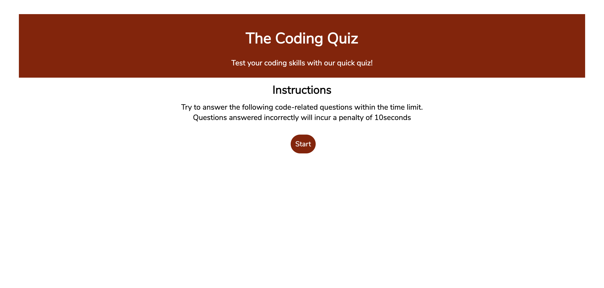
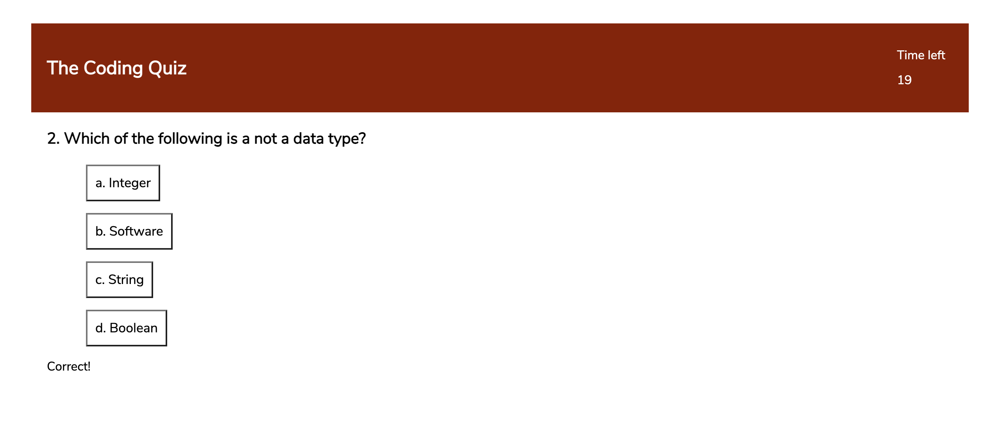
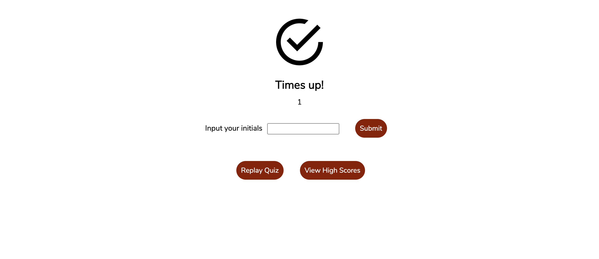
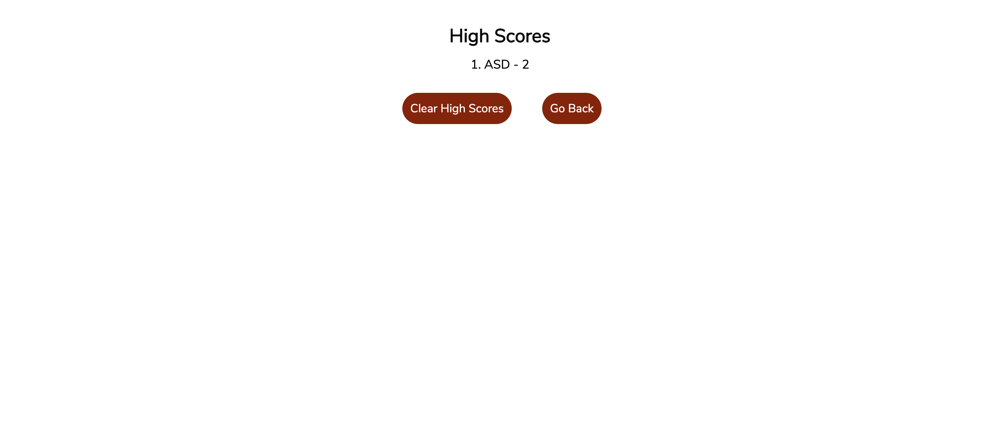

# Code Quiz 

* A timed multiple choice coding quiz built using HTML, CSS and JavaScript. The quiz has an option to view previous scores.

# Table of contents
* GitHub Repository URL
* Screenshots of webpage

# My GitHub Repository URL
* https://github.com/smj3085/Portfolio-page_SLEE
* https://smj3085.github.io/codeQuiz/

# Screenshot 

